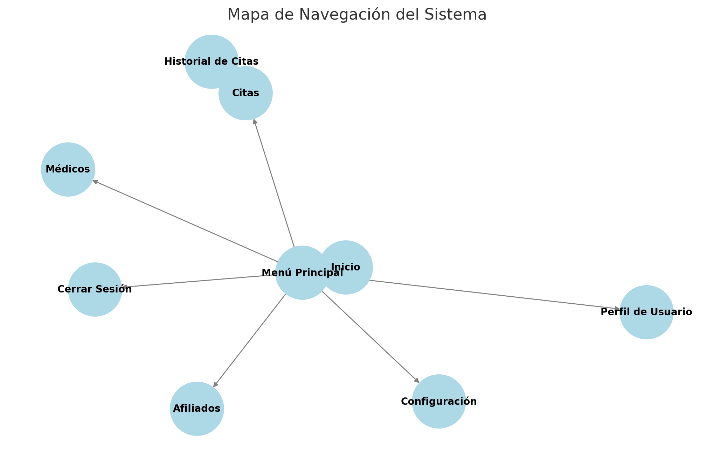

**Diseño y Desarrollo de una Aplicación Web para la Gestión de Citas de Especialidades Médicas**

### 1. Diseño Conceptual

#### 1.1 Entidades Principales
Las entidades principales representan los objetos clave del sistema:
- **Paciente:** Representa a los usuarios que agendan citas médicas.
- **Médico:** Representa a los especialistas que brindan atención médica.
- **Cita:** Registro de la programación de una consulta médica.
- **Especialidad:** Clasificación de los médicos según su área de atención.
- **Horarios de Médicos:** Tabla de detalle que almacena los días y horarios en que cada médico atiende.
- **Historial de Citas:** Registro del ciclo de vida de una cita, desde su creación hasta su finalización o cancelación.

#### 1.2 Relaciones entre Entidades
Las entidades del sistema están relacionadas de la siguiente manera:
- Un **Paciente** puede agendar varias **Citas**, pero una **Cita** pertenece a un solo **Paciente** (relación 1:N).
- Un **Médico** puede atender muchas **Citas**, pero una **Cita** está asociada a un solo **Médico** (relación 1:N).
- Un **Médico** puede tener varias **Especialidades**, y una **Especialidad** puede ser ejercida por varios **Médicos** (relación M:N).
- Un **Médico** tiene un conjunto de **Horarios de Atención** donde está disponible para citas (relación 1:N).
- Una **Cita** tiene un **Historial de Citas** que documenta su ciclo de vida (relación 1:N).

#### 1.3 Atributos Clave
Cada entidad cuenta con atributos fundamentales:
- **Paciente:** Nombre, Fecha de Nacimiento, Documento de Identidad, Teléfono.
- **Médico:** Nombre, Especialidad, Registro Profesional.
- **Cita:** Fecha, Hora, Estado de la Cita (Pendiente, Confirmada, Cancelada, Atendida).
- **Especialidad:** Nombre, Descripción.
- **Horarios de Médicos:** Día de la Semana, Hora de Inicio, Hora de Fin.
- **Historial de Citas:** ID de Cita, Fecha de Cambio de Estado, Estado Anterior, Estado Nuevo, Observaciones.

#### 1.4 Reglas de Negocio Básicas
Se establecen restricciones esenciales:
- Un **Médico** solo puede atender citas dentro de su **Horario de Atención** registrado.
- Un **Paciente** no puede agendar dos citas en el mismo horario.
- Las **Citas** deben confirmarse antes de su fecha y hora programada.
- Un **Médico** no puede atender especialidades que no tenga registradas en el sistema.
- Todas las transiciones de estado de una **Cita** deben quedar registradas en el **Historial de Citas**.

#### 1.5 Conceptos Abstractos y Taxonomía
El sistema maneja clasificaciones jerárquicas:
- **Tipos de Especialidades:** Cardiología, Neurología, Reumatología, etc.
- **Estados de Cita:** Pendiente, Confirmada, Cancelada, Atendida.
- **Disponibilidad de Médicos:** Horarios definidos para cada día de atención.
- **Estados de Historial de Citas:** Registro de cambios en el estado de la cita.

### 2. Modelo Relacional del Diseño de la Base de Datos
El diseño de la base de datos se estructura en las siguientes entidades principales:
- **Pacientes** (almacena información de los usuarios del sistema).
- **Médicos** (información sobre los profesionales de salud).
- **Horarios de Médicos** (detalle de los días y horarios de atención de cada médico).
- **Citas** (gestiona las consultas agendadas y su estado).
- **Historial de Citas** (almacena el ciclo de vida de cada cita con cambios de estado y observaciones).
- **Especialidades** (categoriza a los médicos por su área de atención).

Las relaciones entre estas entidades garantizan la integridad referencial y permiten la recuperación eficiente de datos mediante consultas SQL optimizadas.

### 3. Diagrama de Casos de Uso
Se han identificado los siguientes actores clave:
- **Paciente:** Puede buscar médicos, agendar y cancelar citas.
- **Médico:** Puede consultar su agenda y gestionar disponibilidad.
- **Administrador:** Gestiona usuarios, especialidades y la base de datos.

Los casos de uso principales incluyen:
- Agendar cita.
- Modificar cita.
- Cancelar cita.
- Consultar disponibilidad de médicos.
- Gestionar afiliados y médicos.

Estos casos de uso serán representados en un diagrama UML documentado en el repositorio.

### 4. Diseño de la Arquitectura de Software
La arquitectura del sistema sigue un enfoque **cliente-servidor** con una división clara de responsabilidades:
- **Frontend (React.js con Tailwind CSS):** Responsable de la interfaz de usuario.
- **Backend (Ruby on Rails):** Expone una API REST para la comunicación con la base de datos.
- **Base de Datos (Oracle):** Gestiona los datos de la aplicación.
- **Autenticación (JWT o OAuth2):** Maneja la seguridad del sistema.

Se documentará el esquema de la arquitectura en el repositorio de GitHub con diagramas que representen la estructura del sistema.

### 5. Mapa de Navegación

---

Este diseño será documentado en el repositorio **[hclp-online](https://github.com/hclazarte/hclp-online)** y servirá de base para la implementación del sistema.

