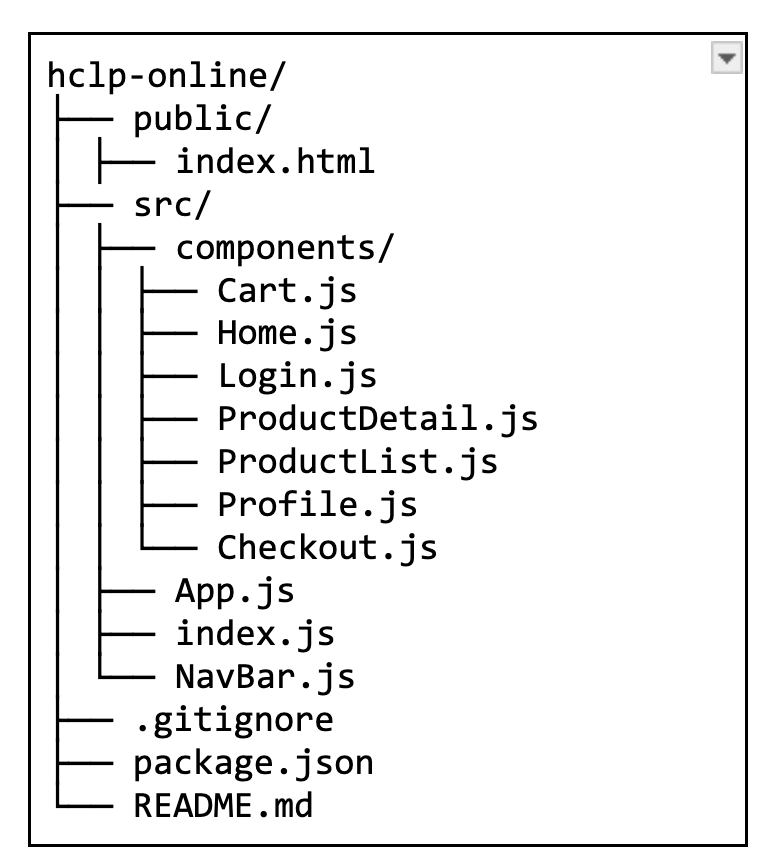

# Proyecto eCommerce Interactivo y Responsivo

Este proyecto es una maqueta y prototipo inicial de la interfaz de usuario de una plataforma de eCommerce. Utiliza tecnologías modernas como HTML5, CSS3 y Bootstrap para garantizar una experiencia interactiva y responsiva. La implementación se ha realizado utilizando React.js.

## Información del Curso

- **Universidad:** Broward International University
- **Maestría:** Ciencias de Ingeniería de Software Informático
- **Curso:** PROGRAMMING THE INTERNET (CSE642)
- **Tarea:** Tarea: Asignación No. 2 Diseño de la maqueta y prototipo inicial de la Interfaz de usuario de la Plataforma eCommerce. Interactiva y Responsiva usando HTML5, CSS3 y Bootstrap - ENTREGA AVANCE
- **Profesor:** PHD Cristian Gabriel Zambrano Vega
- **Alumno:** Ing. Héctor Cristóbal Lazarte

## Descripción del Proyecto

El objetivo de este proyecto es diseñar y desarrollar una maqueta y prototipo inicial de la interfaz de usuario de una plataforma eCommerce, que sea interactiva y responsiva. Para lograr esto, se utilizarán las siguientes tecnologías:

- **React.js**: Para la construcción de la interfaz de usuario.
- **HTML5**: Para la estructura del contenido web.
- **CSS3**: Para el estilo y diseño visual.
- **Bootstrap**: Para el diseño responsivo y componentes de interfaz de usuario.

## Estructura del Proyecto

El proyecto está estructurado de la siguiente manera:

hclp-online/



## Instalación y Configuración

Sigue los siguientes pasos para configurar y ejecutar el proyecto localmente:

1. **Clonar el repositorio:**

   ```sh
   git clone https://github.com/tu-usuario/hclp-online.git
   cd hclp-online

2. **Instalar Dependencias:**

   ```sh
   npm install   

3. **Iniciar el Servidor:**
   ```sh
   npm start
